# SaaS ENEM - Diagramas de Fluxo

## 1. Fluxo de Registro e Onboarding

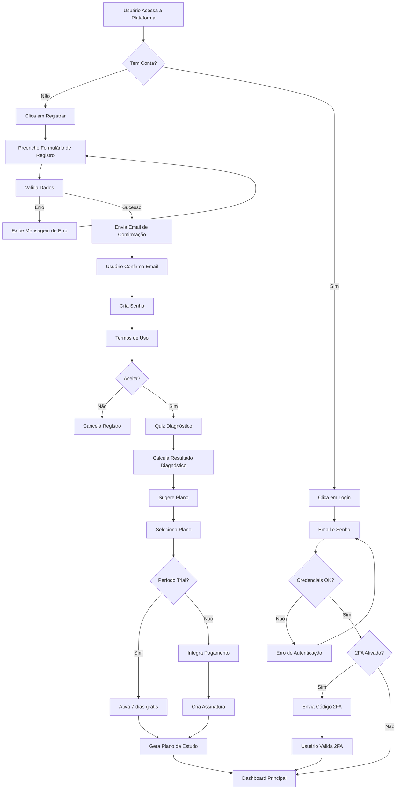

---

## 2. Fluxo de Simulado

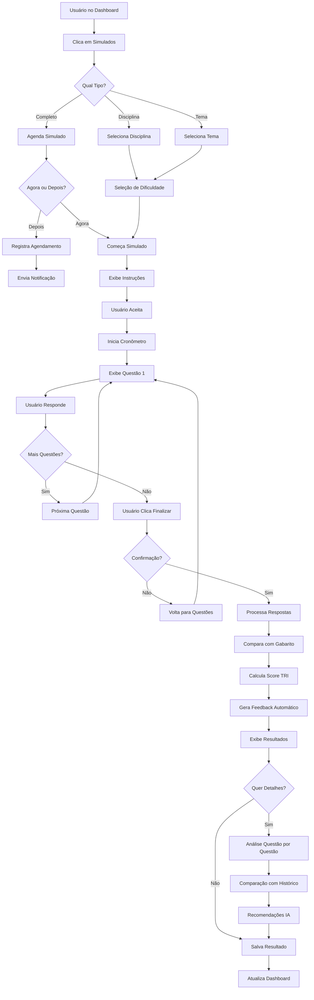

---

## 3. Fluxo de Análise de Desempenho

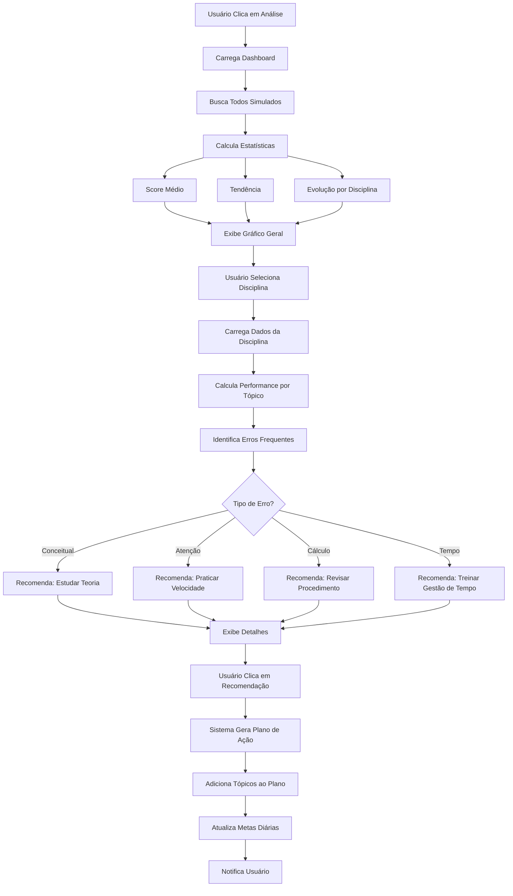

---

## 4. Fluxo de Redação

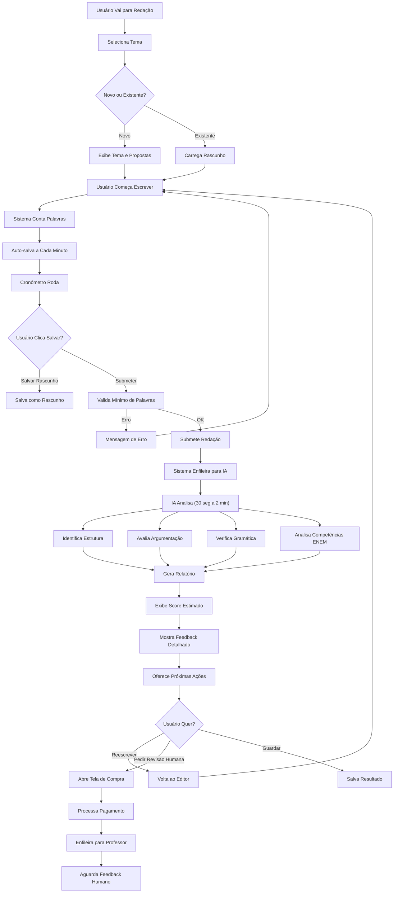

---

## 5. Fluxo de Plano de Estudo Personalizado

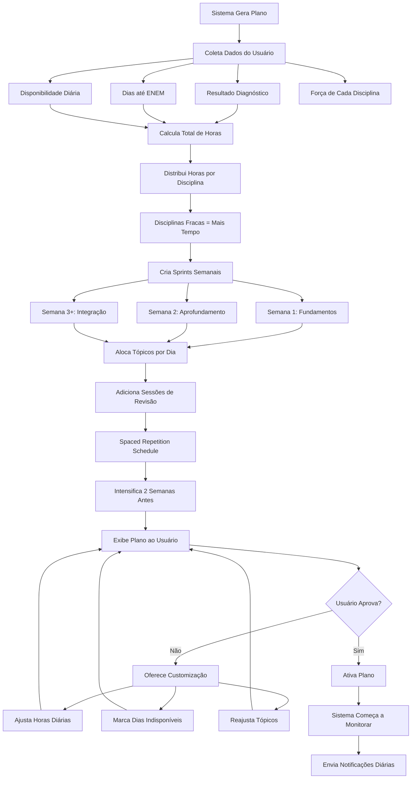

---

## 6. Fluxo de Detecção de Atraso e Contingência

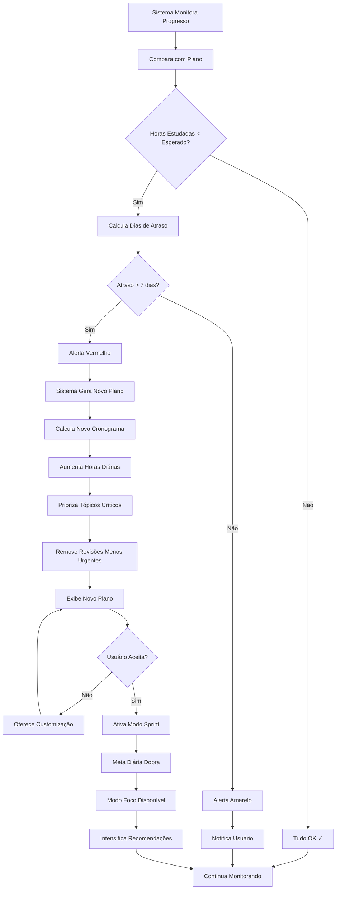

---

## 7. Fluxo de Comunidade/Fórum

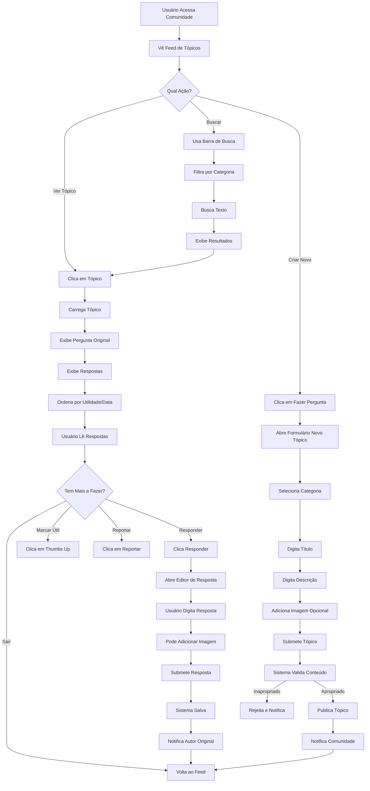

---

## 8. Fluxo de Mentoria

```mermaid
graph TD
    A["Usuário Acessa Mentoria"] --> B["Vê Professores Disponíveis"]
    B --> C["Clica em Professor"]
    C --> D["Exibe Perfil do Professor"]
    D --> E{"Quer Agendar?"}
    
    E -->|Não| F["Volta à Lista"]
    E -->|Sim| G["Clica Agendar Sessão"]
    
    G --> H["Seleciona Data e Hora"]
    H --> I["Seleciona Tópico/Dúvida"]
    I --> J["Sistema Calcula Preço"]
    J --> K["Exibe Resumo"]
    K --> L{"Confirma?"}
    
    L -->|Não| M["Volta para Seleção"]
    M --> H
    L -->|Sim| N["Processa Pagamento"]
    
    N --> O{"Pagamento OK?"}
    O -->|Erro| P["Mensagem de Erro"]
    P --> N
    O -->|OK| Q["Cria Agendamento"]
    
    Q --> R["Notifica Professor"]
    R --> S["Notifica Aluno"]
    S --> T["Aguarda Sessão"]
    T --> U{"Horário Chegou?"]
    
    U -->|Não| V["Envia Lembretes"]
    V --> U
    U -->|Sim| W["Abre Sala de Videoconferência"]
    
    W --> X["Aluno Entra"]
    X --> Y["Professor Entra"]
    Y --> Z["Inicia Gravação"]
    Z --> AA["Sessão de 1 Hora"]
    
    AA --> AB["Professor Pode Compartilhar Tela"]
    AA --> AC["Usuário Pode Ver Quadro"]
    AA --> AD["Chat Disponível"]
    
    AB --> AE["Fim da Sessão"]
    AC --> AE
    AD --> AE
    
    AE --> AF["Para Gravação"]
    AF --> AG["Salva Vídeo"]
    AG --> AH["Envia Link ao Aluno"]
    AH --> AI["Envia Resumo por Email"]
    AI --> AJ["Aluno Avalia Sessão"]
```

---

## 9. Fluxo de Gamificação

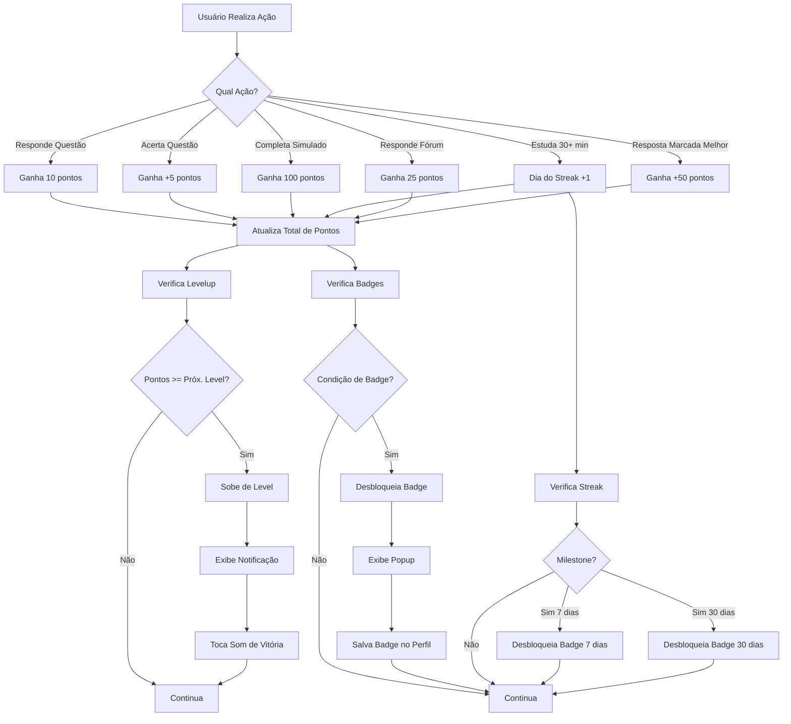

---

## 10. Fluxo de Notificações

```mermaid
graph TD
    A["Sistema Detecta Evento"] --> B{"Tipo de Evento?"}
    
    B -->|Hora de Estudar| C["Notificação: Lembrete Estudo"]
    B -->|Meta Não Atingida| D["Notificação: Meta Não Atingida"]
    B -->|Score Alto| E["Notificação: Novo Recorde"]
    B -->|Badge Desbloqueado| F["Notificação: Badge"]
    B -->|Resposta no Fórum| G["Notificação: Nova Resposta"]
    B -->|Feedback Redação| H["Notificação: Redação Analisada"]
    B -->|Atraso Detectado| I["Notificação: Você Está Atrasado"]
    
    C --> J["Sistema Verifica Preferências"]
    D --> J
    E --> J
    F --> J
    G --> J
    H --> J
    I --> J
    
    J --> K{"Push ativado?"}
    J --> L{"Email ativado?"}
    J --> M{"SMS ativado?"}
    J --> N{"In-app ativado?"}
    
    K -->|Sim| O["Envia Push"]
    K -->|Não| P["Pula Push"]
    
    L -->|Sim| Q["Envia Email"]
    L -->|Não| R["Pula Email"]
    
    M -->|Sim| S["Envia SMS"]
    M -->|Não| T["Pula SMS"]
    
    N -->|Sim| U["Mostra In-app"]
    N -->|Não| V["Pula In-app"]
    
    O --> W{"Dentro do Horário?"}
    Q --> W
    S --> W
    U --> W
    
    W -->|Não (silêncio)| X["Agenda para Depois"]
    W -->|Sim| Y["Envia Notificação"]
    
    Y --> Z["Usuário Recebe"]
    Z --> AA{"Clica?"}
    AA -->|Sim| AB["Abre a Página Relacionada"]
    AA -->|Não| AC["Marca como Lida"]
```

---

## 11. Fluxo de Pagamento e Assinatura

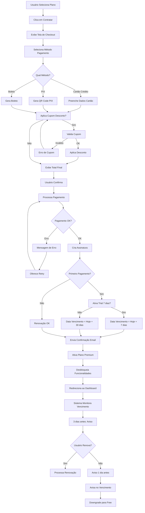

---

## 12. Fluxo de Login com 2FA

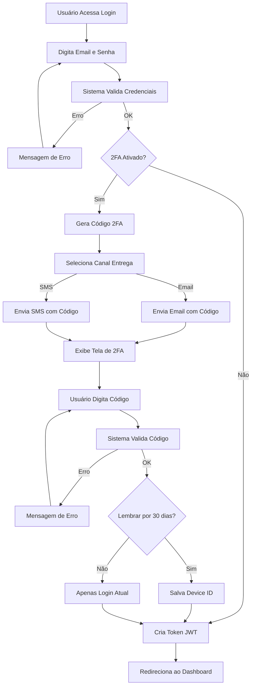

---

## 13. Fluxo de Seleção de Questões por Filtro

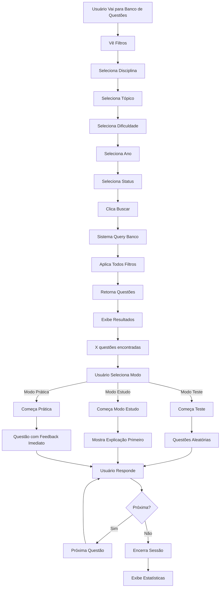

---

## 14. Fluxo de Cálculo de Previsão de Score

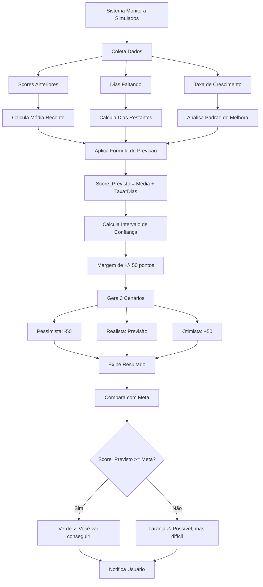

---

## 15. Fluxo de Adaptação Dinâmica de Plano

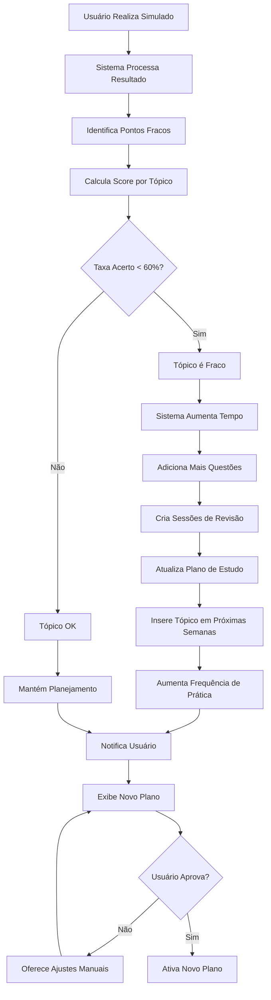

---

## 16. Fluxo Geral da Aplicação

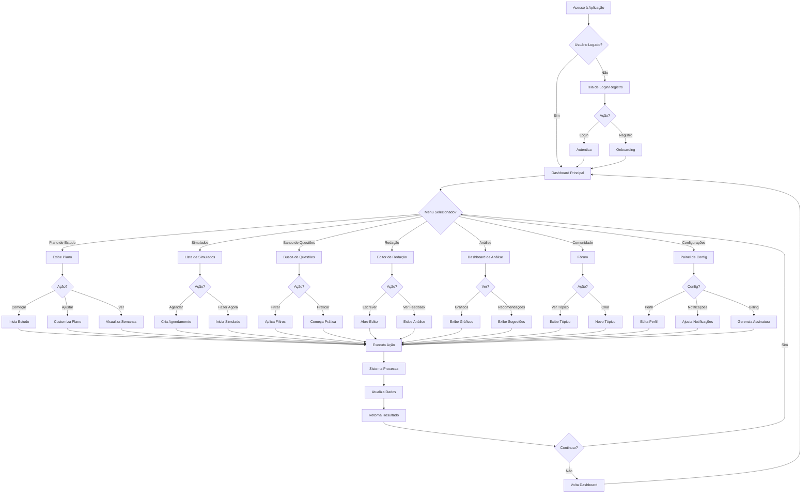

---

## Legenda dos Diagramas

- **Retângulo** = Ação ou Estado
- **Losango** = Decisão (condição)
- **Seta** = Fluxo/Sequência
- **Cores** (conceitual):
  - Verde = Sucesso
  - Vermelho = Erro
  - Amarelo = Aviso
  - Azul = Informação

---

**Nota:** Estes diagramas podem ser convertidos para imagens SVG/PNG usando ferramentas como:
- Mermaid Live Editor (https://mermaid.live)
- draw.io
- Lucidchart

Ou incorporados diretamente em documentação usando a sintaxe Mermaid.
