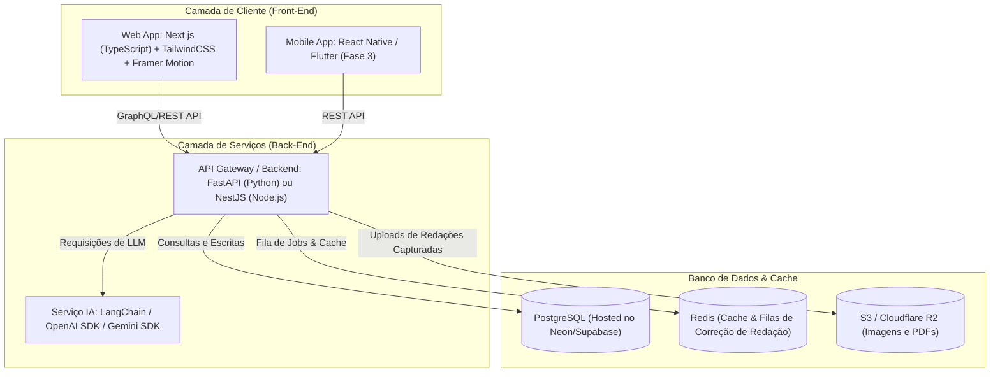

# SaaS ENEM - Plano de Desenvolvimento & Especificação Técnica Unificada

Este documento reúne **todas** as diretrizes do projeto **SaaS ENEM**, incluindo a análise técnica, arquitetura recomendada, cronograma de desenvolvimento faseado e a consolidação de todas as especificações originais (Banco de Dados, Fluxos de Usuário, Funcionalidades e Wireframes).

---

## 📋 Índice Geral

1. [Visão Geral do Projeto](#-visão-geral-do-projeto)
2. [Arquitetura de Software & Stack Recomendada](#-arquitetura-de-software--stack-recomendada)
3. [Plano de Desenvolvimento & Cronograma Detalhado (Roadmap)](#-plano-de-desenvolvimento--cronograma-detalhado-roadmap)
4. [Especificação Completa do Banco de Dados](#-especificação-completa-do-banco-de-dados)
5. [Fluxos da Aplicação (Diagramas Mermaid)](#-fluxos-da-aplicação-diagramas-mermaid)
6. [Detalhamento de Funcionalidades (O Escopo)](#-detalhamento-de-funcionalidades-o-escopo)
7. [Wireframes e Layouts de UI/UX](#-wireframes-e-layouts-de-uiux)
8. [Estratégia de Integração de IA (Redação & Desempenho)](#-estratégia-de-integração-de-ia-redação--desempenho)

---

## 🎯 Visão Geral do Projeto

O **SaaS ENEM** é um ecossistema completo de preparação de alta performance para o Exame Nacional do Ensino Médio. Diferente de plataformas de estudo tradicionais passivas, o SaaS ENEM é estruturado sobre **três pilares inteligentes**:
1. **Hiper-Personalização Dinâmica**: Geração automática de cronograma de estudos com base em diagnóstico e ajuste adaptativo em tempo real se o aluno atrasar ou falhar em simulados.
2. **Correção de Redação Assistida por IA**: Análise instantânea baseada nas 5 Competências oficiais do ENEM.
3. **Engajamento e Gamificação**: Gamificação densa com pontos, níveis, streaks diários e rankings para garantir consistência e retenção.

---

## 💻 Arquitetura de Software & Stack Recomendada

Para entregar uma experiência de alta performance, tempo de resposta excelente (<300ms nas rotas críticas), escalabilidade e capacidade de integração de Inteligência Artificial, recomendamos a seguinte stack:



### 1. Front-End (Web & Mobile Companion)
*   **Web Framework**: **Next.js (App Router)** com TypeScript. Garante SEO excelente nas landing pages e blog da comunidade, além de performance via Server-Side Rendering (SSR) e Static Site Generation (SSG).
*   **Styling & UI**: **TailwindCSS** + **Shadcn/ui** para componentes premium e minimalistas, customizados em HSL de acordo com a paleta proposta (Azul `#2563eb`, Verde `#10b981`, Escuro Moderno).
*   **Animações**: **Framer Motion** para micro-interações, transições fluidas e popups de gamificação (vitórias, badges).
*   **Gráficos**: **Recharts** ou **Chart.js** para renderização rápida e responsiva das curvas de desempenho e previsões TRI.

### 2. Back-End & Serviços
*   **Framework Principal**: **FastAPI (Python)** ou **NestJS (TypeScript)**.
    *   *Recomendação*: **FastAPI** é altamente recomendado devido à integração nativa com ecossistemas de IA, facilidade em criar pipelines assíncronos de análise estatística (TRI) e processamento rápido com validação Pydantic.
*   **ORM / Query Builder**: **Prisma ORM** (se NestJS) ou **SQLAlchemy / SQLModel** (se FastAPI).
*   **Banco de Dados Relacional**: **PostgreSQL** hospedado na Neon ou Supabase. Essencial devido ao forte relacionamento exigido pela modelagem e à capacidade nativa de indexação em JSONB (usado nos planos dinâmicos e perfis de aprendizado).
*   **Cache & Filas**: **Redis**. Essencial para controle de limite de tentativas de login, cache de questões frequentes, armazenamento de dados do cronômetro de simulados activos (segurança contra quedas de internet) e filas para análise de redação por IA.

### 3. Integrações de Terceiros
*   **Gateway de Pagamento**: **Stripe** ou **Asaas** (excelente para PIX nativo e boleto recorrente com baixa taxa no Brasil).
*   **Serviços de IA**: **OpenAI API (GPT-4o)** para correções estruturais refinadas e **Gemini 1.5 Pro/Flash** para análise rápida de texto e OCR (caso o aluno tire foto de uma redação escrita à mão).
*   **Notificações & Comunicação**: **Twilio** (SMS para planos premium) e **Resend / SendGrid** (emails transacionais de onboarding e lembretes).
*   **Autenticação**: **Auth0 / Supabase Auth** ou **NextAuth.js** com suporte integrado a 2FA.

---

## 📅 Plano de Desenvolvimento & Cronograma Detalhado (Roadmap)

Dividimos o projeto em um cronograma estratégico de **24 semanas** (6 meses), estruturado em sprints quinzenais para garantir que o MVP (Fase 1) seja entregue rapidamente para validação.

### Visão Geral das Fases

```
[Fase 1: MVP Core] ──────► [Fase 2: IA & TRI] ──────► [Fase 3: Social & Game] ──────► [Fase 4: Mobile & Scale]
  (Semanas 1 a 6)            (Semanas 7 a 12)           (Semanas 13 a 18)           (Semanas 19 a 24)
```

---

### Detalhamento das Sprints

#### FASE 1: MVP Core & Infraestrutura (Semanas 1-6)
*   **Objetivo**: Construir a espinha dorsal do sistema (Autenticação, Banco de Dados, Questionário Diagnóstico e a Geração de Plano de Estudo Estático).
*   **Sprint 1 (Semanas 1-2): Setup, DB & Autenticação**
    *   Setup de infraestrutura de DevOps (CI/CD na Vercel e Render/AWS).
    *   Provisionamento do PostgreSQL com migrations iniciais.
    *   Implementação do módulo de Autenticação segura (JWT, Login, Registro, recuperação e 2FA).
    *   Wireframes de Login e Registro convertidos em UI responsiva premium.
*   **Sprint 2 (Semanas 3-4): Onboarding & Quiz Diagnóstico**
    *   Criação da interface do Quiz Diagnóstico Inicial (50 questões dinâmicas).
    *   Algoritmo básico para coletar os inputs de dificuldade, tempo disponível e estilo de aprendizado.
    *   Integração e salvamento do `learning_profile` e `diagnostics` no banco de dados.
*   **Sprint 3 (Semanas 5-6): Geração do Plano de Estudo Personalizado & Dashboard**
    *   Construção do algoritmo gerador de cronograma que distribui matérias baseado nos pesos das fraquezas identificadas.
    *   Dashboard principal com contagem regressiva ENEM, progresso geral e meta diária de estudos.
    *   Implementação da visualização do plano em Timeline e Visão Semanal.

#### FASE 2: Simulados Inteligentes, TRI & Correção IA (Semanas 7-12)
*   **Objetivo**: Adicionar inteligência e automação ao SaaS (Simulados, estimativa TRI e correção de redação por IA).
*   **Sprint 4 (Semanas 7-8): Banco de Questões & Engine de Provas**
    *   Popular banco de dados com questões oficiais (ENEM anterior) e suas respectivas opções.
    *   Interface de realização de Simulado (Timer persistente contra oscilações de conexão, navegador de questões lateral).
    *   Integração do modo de estudo por temas com feedback imediato das respostas.
*   **Sprint 5 (Semanas 9-10): Correção Automática, TRI & Dashboard de Desempenho**
    *   Algoritmo matemático de cálculo TRI estimado (pesos das questões baseado no acerto geral dos usuários).
    *   Dashboard analítico completo: curvas de melhora, gráficos de linha por disciplinas e previsão de score final.
    *   Implementação das categorias de erro (Conceitual, Atenção, Cálculo, Tempo).
*   **Sprint 6 (Semanas 11-12): Editor de Redação & Corretor IA**
    *   Desenvolvimento do Editor de Redação com contagem de palavras dinâmicas e timer.
    *   Integração com LLM (GPT-4o/Gemini) parametrizado para avaliar o texto estritamente nas 5 Competências oficiais do ENEM.
    *   Criação do relatório detalhado com anotações inline dos erros gramaticais e sugestões estruturais de proposta de solução.

#### FASE 3: Engajamento, Gamificação, Mentoria e Comunidade (Semanas 13-18)
*   **Objetivo**: Elevar a retenção do aluno adicionando interações comunitárias e dinâmicas motivacionais.
*   **Sprint 7 (Semanas 13-14): Gamificação Avançada (Streaks, Badges e Níveis)**
    *   Engine de detecção de atividades diárias (mínimo de 30 minutos) para manter e queimar streaks.
    *   Geração e salvamento de badges (Largada, Matemático, Campeão) com gatilhos de conquistas.
    *   Sistema de XP (Pontos), levels e o Leaderboard (Ranking Global Anônimo).
*   **Sprint 8 (Semanas 15-16): Fórum Comunitário & Redes Sociais**
    *   Módulo de Comunidade: Criação de tópicos, categorias de discussão por disciplinas e respostas.
    *   Recurso de "Marcar como Melhor Resposta" e votos úteis.
    *   Integração do painel de moderação no Admin Dashboard para conter spams ou condutas fora das diretrizes.
*   **Sprint 9 (Semanas 17-18): Agendamento de Mentorias & Integração Google Calendar**
    *   Plataforma de mentoria ao vivo: perfis de professores credenciados, calendário de disponibilidades e reservas.
    *   Integração com Google Calendar API para sincronização bidirecional automática de sessões de mentoria e blocos de estudo diários.

#### FASE 4: Plano de Contingência, App Mobile & Lançamento (Semanas 19-24)
*   **Objetivo**: Criar redundância de planos, expandir para canais mobile, integrar sistemas financeiros e realizar polimento final.
*   **Sprint 10 (Semanas 19-20): Algoritmo de Contingência & Sessões Turbo**
    *   Implementação do monitor automático de atraso.
    *   Desenvolvimento do algoritmo regenerador do plano de ação de contingência (priorização de tópicos críticos/frequentes).
    *   Desenvolvimento das "Sessões Turbo" de 10-15 minutos para recuperação rápida.
*   **Sprint 11 (Semanas 21-22): Integração Financeira & Planos Premium**
    *   Integração do Stripe/Asaas para assinaturas (Freemium, 6 meses, 3 meses, 1 mês).
    *   Sistema de checkout com cupons de desconto, trial de 7 dias e emissão automática de cobranças recorrentes.
    *   Configuração do fluxo de Upgrade / Downgrade automático e suporte a add-ons (ex: contratação de corretor humano de redação).
*   **Sprint 12 (Semanas 23-24): Versão Mobile Companion (PWA/Hybrid) & Go-to-Market**
    *   Ajustes de viewport para Web App se comportar como PWA de alta fidelidade ou build nativo.
    *   Ativação dos widgets nativos do contador de dias e streak de dias no celular do usuário.
    *   Polimento de design (micro-animações CSS adicionadas às páginas lentas).
    *   Testes de carga (Load Testing) da infraestrutura e lançamento oficial do SaaS ENEM.

---

## 🗄️ Especificação Completa do Banco de Dados

Esta é a definição formal do esquema de dados físico estruturado em SQL compatível com PostgreSQL, ideal para suportar a lógica relacional robusta exigida pelo SaaS ENEM.

### Esquema Físico de Criação de Tabelas

```sql
-- 1. TABELA: users
CREATE TABLE users (
    id UUID PRIMARY KEY DEFAULT gen_random_uuid(),
    name VARCHAR(255) NOT NULL,
    email VARCHAR(255) NOT NULL UNIQUE,
    password_hash VARCHAR(255) NOT NULL,
    date_of_birth DATE NOT NULL,
    email_verified BOOLEAN DEFAULT FALSE,
    account_status VARCHAR(50) DEFAULT 'active', -- active, suspended, deleted
    phone VARCHAR(20),
    profile_picture_url TEXT,
    created_at TIMESTAMP DEFAULT CURRENT_TIMESTAMP,
    updated_at TIMESTAMP DEFAULT CURRENT_TIMESTAMP,
    deleted_at TIMESTAMP NULL
);
CREATE INDEX idx_users_email ON users(email);
CREATE INDEX idx_users_status ON users(account_status);

-- 2. TABELA: subscriptions
CREATE TABLE subscriptions (
    id UUID PRIMARY KEY DEFAULT gen_random_uuid(),
    user_id UUID NOT NULL,
    plan_type VARCHAR(50) NOT NULL, -- free, premium_6m, premium_3m, premium_1m
    status VARCHAR(50) DEFAULT 'active', -- active, expired, cancelled
    start_date TIMESTAMP NOT NULL DEFAULT CURRENT_TIMESTAMP,
    end_date TIMESTAMP NOT NULL,
    payment_method VARCHAR(50), -- credit_card, pix, boleto
    amount_paid DECIMAL(10, 2),
    payment_id VARCHAR(255),
    stripe_subscription_id VARCHAR(255),
    auto_renewal BOOLEAN DEFAULT TRUE,
    created_at TIMESTAMP DEFAULT CURRENT_TIMESTAMP,
    updated_at TIMESTAMP DEFAULT CURRENT_TIMESTAMP,
    
    FOREIGN KEY (user_id) REFERENCES users(id) ON DELETE CASCADE
);
CREATE INDEX idx_subscriptions_user ON subscriptions(user_id);
CREATE INDEX idx_subscriptions_status ON subscriptions(status);
CREATE INDEX idx_subscriptions_end_date ON subscriptions(end_date);

-- 3. TABELA: learning_profiles
CREATE TABLE learning_profiles (
    id UUID PRIMARY KEY DEFAULT gen_random_uuid(),
    user_id UUID NOT NULL UNIQUE,
    learning_style VARCHAR(50), -- visual, auditory, kinesthetic
    preferred_time VARCHAR(20), -- morning, afternoon, evening
    daily_hours_goal DECIMAL(3, 1) DEFAULT 2.0,
    available_days JSONB, -- ["seg", "ter", "qua", "qui", "sex"]
    timezone VARCHAR(50) DEFAULT 'America/Sao_Paulo',
    language VARCHAR(10) DEFAULT 'pt-BR',
    created_at TIMESTAMP DEFAULT CURRENT_TIMESTAMP,
    updated_at TIMESTAMP DEFAULT CURRENT_TIMESTAMP,
    
    FOREIGN KEY (user_id) REFERENCES users(id) ON DELETE CASCADE
);
CREATE INDEX idx_learning_profiles_user ON learning_profiles(user_id);

-- 4. TABELA: diagnostics
CREATE TABLE diagnostics (
    id UUID PRIMARY KEY DEFAULT gen_random_uuid(),
    user_id UUID NOT NULL,
    linguagens_score INT,
    matematica_score INT,
    cn_score INT,
    ch_score INT,
    redacao_score INT,
    estimated_hours INT,
    weak_areas JSONB, -- [{subject: "matematica", percentage: 45, recommendation: "..."}]
    learning_profile VARCHAR(50),
    completed_at TIMESTAMP NOT NULL DEFAULT CURRENT_TIMESTAMP,
    created_at TIMESTAMP DEFAULT CURRENT_TIMESTAMP,
    
    FOREIGN KEY (user_id) REFERENCES users(id) ON DELETE CASCADE
);
CREATE INDEX idx_diagnostics_user ON diagnostics(user_id);
CREATE INDEX idx_diagnostics_completed ON diagnostics(completed_at);

-- 5. TABELA: study_plans
CREATE TABLE study_plans (
    id UUID PRIMARY KEY DEFAULT gen_random_uuid(),
    user_id UUID NOT NULL,
    diagnostic_id UUID,
    total_hours_available INT NOT NULL,
    daily_hours_goal DECIMAL(3, 1) NOT NULL DEFAULT 2.0,
    weeks_remaining INT,
    status VARCHAR(50) DEFAULT 'active', -- active, paused, completed
    is_contingency BOOLEAN DEFAULT FALSE,
    created_at TIMESTAMP DEFAULT CURRENT_TIMESTAMP,
    updated_at TIMESTAMP DEFAULT CURRENT_TIMESTAMP,
    
    FOREIGN KEY (user_id) REFERENCES users(id) ON DELETE CASCADE,
    FOREIGN KEY (diagnostic_id) REFERENCES diagnostics(id) ON DELETE SET NULL
);
CREATE INDEX idx_study_plans_user ON study_plans(user_id);
CREATE INDEX idx_study_plans_status ON study_plans(status);

-- 6. TABELA: weekly_sprints
CREATE TABLE weekly_sprints (
    id UUID PRIMARY KEY DEFAULT gen_random_uuid(),
    study_plan_id UUID NOT NULL,
    week_number INT NOT NULL,
    start_date DATE NOT NULL,
    end_date DATE NOT NULL,
    theme VARCHAR(255),
    total_hours_allocated DECIMAL(5, 1),
    hours_completed DECIMAL(5, 1) DEFAULT 0,
    status VARCHAR(50) DEFAULT 'not_started', -- not_started, in_progress, completed
    created_at TIMESTAMP DEFAULT CURRENT_TIMESTAMP,
    updated_at TIMESTAMP DEFAULT CURRENT_TIMESTAMP,
    
    FOREIGN KEY (study_plan_id) REFERENCES study_plans(id) ON DELETE CASCADE
);
CREATE INDEX idx_weekly_sprints_plan ON weekly_sprints(study_plan_id);
CREATE INDEX idx_weekly_sprints_dates ON weekly_sprints(start_date, end_date);

-- 7. TABELA: topics
CREATE TABLE topics (
    id UUID PRIMARY KEY DEFAULT gen_random_uuid(),
    weekly_sprint_id UUID NOT NULL,
    name VARCHAR(255) NOT NULL,
    subject VARCHAR(100), -- linguagens, matematica, cn, ch
    hours_allocated DECIMAL(3, 1),
    type VARCHAR(50), -- theory, practice, review
    priority VARCHAR(50), -- low, medium, high, critical
    scheduled_days JSONB, -- ["seg", "ter", "qua"]
    is_completed BOOLEAN DEFAULT FALSE,
    completed_at TIMESTAMP NULL,
    created_at TIMESTAMP DEFAULT CURRENT_TIMESTAMP,
    updated_at TIMESTAMP DEFAULT CURRENT_TIMESTAMP,
    
    FOREIGN KEY (weekly_sprint_id) REFERENCES weekly_sprints(id) ON DELETE CASCADE
);
CREATE INDEX idx_topics_sprint ON topics(weekly_sprint_id);
CREATE INDEX idx_topics_subject ON topics(subject);

-- 8. TABELA: questions
CREATE TABLE questions (
    id UUID PRIMARY KEY DEFAULT gen_random_uuid(),
    source VARCHAR(50), -- enem_2024, enem_2023, custom
    subject VARCHAR(100), -- linguagens, matematica, cn, ch
    topic VARCHAR(255),
    subtopic VARCHAR(255),
    difficulty VARCHAR(50), -- easy, medium, hard
    year INT,
    statement TEXT NOT NULL,
    image_url TEXT,
    correct_answer VARCHAR(10), -- A, B, C, D, E
    explanation TEXT,
    explanation_video_url TEXT,
    time_estimate_seconds INT DEFAULT 180,
    tri_weight DECIMAL(3, 2) DEFAULT 1.0,
    total_attempts INT DEFAULT 0,
    correct_percentage INT DEFAULT 0,
    times_answered_correctly INT DEFAULT 0,
    related_topics JSONB, -- ["algebra", "funcoes"]
    created_at TIMESTAMP DEFAULT CURRENT_TIMESTAMP,
    updated_at TIMESTAMP DEFAULT CURRENT_TIMESTAMP
);
CREATE INDEX idx_questions_subject ON questions(subject);
CREATE INDEX idx_questions_topic ON questions(topic);
CREATE INDEX idx_questions_difficulty ON questions(difficulty);
CREATE INDEX idx_questions_year ON questions(year);

-- 9. TABELA: question_options
CREATE TABLE question_options (
    id UUID PRIMARY KEY DEFAULT gen_random_uuid(),
    question_id UUID NOT NULL,
    letter VARCHAR(1) NOT NULL, -- A, B, C, D, E
    text TEXT NOT NULL,
    position INT,
    created_at TIMESTAMP DEFAULT CURRENT_TIMESTAMP,
    
    FOREIGN KEY (question_id) REFERENCES questions(id) ON DELETE CASCADE,
    UNIQUE(question_id, letter)
);
CREATE INDEX idx_question_options_question ON question_options(question_id);

-- 10. TABELA: exams
CREATE TABLE exams (
    id UUID PRIMARY KEY DEFAULT gen_random_uuid(),
    exam_type VARCHAR(50), -- complete, by_subject, by_topic, quiz
    subject VARCHAR(100), -- linguagens, matematica, cn, ch, null se completo
    topic VARCHAR(255),
    total_questions INT NOT NULL,
    duration_minutes INT NOT NULL,
    passing_score INT,
    is_template BOOLEAN DEFAULT FALSE,
    created_at TIMESTAMP DEFAULT CURRENT_TIMESTAMP,
    updated_at TIMESTAMP DEFAULT CURRENT_TIMESTAMP
);
CREATE INDEX idx_exams_type ON exams(exam_type);

-- 11. TABELA: scheduled_exams
CREATE TABLE scheduled_exams (
    id UUID PRIMARY KEY DEFAULT gen_random_uuid(),
    user_id UUID NOT NULL,
    exam_id UUID NOT NULL,
    scheduled_at TIMESTAMP NOT NULL,
    status VARCHAR(50) DEFAULT 'scheduled', -- scheduled, started, completed, skipped
    start_time TIMESTAMP NULL,
    end_time TIMESTAMP NULL,
    created_at TIMESTAMP DEFAULT CURRENT_TIMESTAMP,
    updated_at TIMESTAMP DEFAULT CURRENT_TIMESTAMP,
    
    FOREIGN KEY (user_id) REFERENCES users(id) ON DELETE CASCADE,
    FOREIGN KEY (exam_id) REFERENCES exams(id) ON DELETE CASCADE
);
CREATE INDEX idx_scheduled_exams_user ON scheduled_exams(user_id);
CREATE INDEX idx_scheduled_exams_scheduled ON scheduled_exams(scheduled_at);
CREATE INDEX idx_scheduled_exams_status ON scheduled_exams(status);

-- 12. TABELA: exam_results
CREATE TABLE exam_results (
    id UUID PRIMARY KEY DEFAULT gen_random_uuid(),
    user_id UUID NOT NULL,
    scheduled_exam_id UUID NOT NULL,
    exam_id UUID NOT NULL,
    total_questions INT,
    correct_answers INT,
    wrong_answers INT,
    unanswered INT,
    raw_score INT,
    score_estimate INT, -- TRI estimado
    performance_by_subject JSONB, -- {historia: {correct: 10, total: 10}, ...}
    completed_at TIMESTAMP NOT NULL,
    created_at TIMESTAMP DEFAULT CURRENT_TIMESTAMP,
    
    FOREIGN KEY (user_id) REFERENCES users(id) ON DELETE CASCADE,
    FOREIGN KEY (scheduled_exam_id) REFERENCES scheduled_exams(id) ON DELETE CASCADE,
    FOREIGN KEY (exam_id) REFERENCES exams(id) ON DELETE CASCADE
);
CREATE INDEX idx_exam_results_user ON exam_results(user_id);
CREATE INDEX idx_exam_results_scheduled ON exam_results(scheduled_exam_id);
CREATE INDEX idx_exam_results_completed ON exam_results(completed_at);

-- 13. TABELA: exam_answers
CREATE TABLE exam_answers (
    id UUID PRIMARY KEY DEFAULT gen_random_uuid(),
    user_id UUID NOT NULL,
    exam_result_id UUID NOT NULL,
    question_id UUID NOT NULL,
    user_answer VARCHAR(10),
    correct_answer VARCHAR(10),
    is_correct BOOLEAN,
    marked_as_doubt BOOLEAN DEFAULT FALSE,
    time_spent_seconds INT,
    topic VARCHAR(255),
    difficulty VARCHAR(50),
    created_at TIMESTAMP DEFAULT CURRENT_TIMESTAMP,
    
    FOREIGN KEY (user_id) REFERENCES users(id) ON DELETE CASCADE,
    FOREIGN KEY (exam_result_id) REFERENCES exam_results(id) ON DELETE CASCADE,
    FOREIGN KEY (question_id) REFERENCES questions(id) ON DELETE CASCADE
);
CREATE INDEX idx_exam_answers_result ON exam_answers(exam_result_id);
CREATE INDEX idx_exam_answers_question ON exam_answers(question_id);
CREATE INDEX idx_exam_answers_correct ON exam_answers(is_correct);

-- 14. TABELA: essays
CREATE TABLE essays (
    id UUID PRIMARY KEY DEFAULT gen_random_uuid(),
    user_id UUID NOT NULL,
    theme_id UUID,
    theme_title VARCHAR(255),
    text TEXT NOT NULL, -- LONGTEXT
    word_count INT,
    line_count INT,
    status VARCHAR(50) DEFAULT 'draft', -- draft, submitted, under_review, reviewed
    is_from_simulado BOOLEAN DEFAULT FALSE,
    simulado_id UUID,
    submitted_at TIMESTAMP NULL,
    created_at TIMESTAMP DEFAULT CURRENT_TIMESTAMP,
    updated_at TIMESTAMP DEFAULT CURRENT_TIMESTAMP,
    
    FOREIGN KEY (user_id) REFERENCES users(id) ON DELETE CASCADE
);
CREATE INDEX idx_essays_user ON essays(user_id);
CREATE INDEX idx_essays_status ON essays(status);
CREATE INDEX idx_essays_submitted ON essays(submitted_at);

-- 15. TABELA: essay_analyses
CREATE TABLE essay_analyses (
    id UUID PRIMARY KEY DEFAULT gen_random_uuid(),
    essay_id UUID NOT NULL UNIQUE,
    ai_score INT, -- 0-1000
    competency1_score INT, -- Domínio da escrita
    competency2_score INT, -- Compreensão da proposta
    competency3_score INT, -- Seleção de informações
    competency4_score INT, -- Organização de ideias
    competency5_score INT, -- Proposta de solução
    structural_feedback TEXT,
    argument_feedback TEXT,
    language_feedback TEXT,
    grammar_errors JSONB,
    suggestions JSONB,
    analysed_at TIMESTAMP NOT NULL DEFAULT CURRENT_TIMESTAMP,
    created_at TIMESTAMP DEFAULT CURRENT_TIMESTAMP,
    
    FOREIGN KEY (essay_id) REFERENCES essays(id) ON DELETE CASCADE
);
CREATE INDEX idx_essay_analyses_essay ON essay_analyses(essay_id);

-- 16. TABELA: question_stats
CREATE TABLE question_stats (
    id UUID PRIMARY KEY DEFAULT gen_random_uuid(),
    user_id UUID NOT NULL,
    question_id UUID NOT NULL,
    attempts INT DEFAULT 0,
    correct INT DEFAULT 0,
    wrong INT DEFAULT 0,
    skipped INT DEFAULT 0,
    average_time_seconds INT,
    marked_as_doubt BOOLEAN DEFAULT FALSE,
    last_attempted TIMESTAMP,
    created_at TIMESTAMP DEFAULT CURRENT_TIMESTAMP,
    updated_at TIMESTAMP DEFAULT CURRENT_TIMESTAMP,
    
    FOREIGN KEY (user_id) REFERENCES users(id) ON DELETE CASCADE,
    FOREIGN KEY (question_id) REFERENCES questions(id) ON DELETE CASCADE,
    UNIQUE(user_id, question_id)
);
CREATE INDEX idx_question_stats_user ON question_stats(user_id);
CREATE INDEX idx_question_stats_question ON question_stats(question_id);

-- 17. TABELA: community_posts
CREATE TABLE community_posts (
    id UUID PRIMARY KEY DEFAULT gen_random_uuid(),
    user_id UUID NOT NULL,
    category VARCHAR(100), -- duvidas_conteudo, duvidas_plataforma, motivacao, dicas
    title VARCHAR(255) NOT NULL,
    content TEXT NOT NULL,
    image_url TEXT,
    view_count INT DEFAULT 0,
    reply_count INT DEFAULT 0,
    helpful_count INT DEFAULT 0,
    status VARCHAR(50) DEFAULT 'published', -- published, pending, rejected, deleted
    created_at TIMESTAMP DEFAULT CURRENT_TIMESTAMP,
    updated_at TIMESTAMP DEFAULT CURRENT_TIMESTAMP,
    deleted_at TIMESTAMP NULL,
    
    FOREIGN KEY (user_id) REFERENCES users(id) ON DELETE CASCADE
);
CREATE INDEX idx_community_posts_user ON community_posts(user_id);
CREATE INDEX idx_community_posts_category ON community_posts(category);
CREATE INDEX idx_community_posts_status ON community_posts(status);
CREATE INDEX idx_community_posts_created ON community_posts(created_at);

-- 18. TABELA: community_replies
CREATE TABLE community_replies (
    id UUID PRIMARY KEY DEFAULT gen_random_uuid(),
    post_id UUID NOT NULL,
    user_id UUID NOT NULL,
    parent_reply_id UUID, -- Para replies aninhadas
    content TEXT NOT NULL,
    is_solution BOOLEAN DEFAULT FALSE,
    is_teacher_reply BOOLEAN DEFAULT FALSE,
    helpful_count INT DEFAULT 0,
    status VARCHAR(50) DEFAULT 'published',
    created_at TIMESTAMP DEFAULT CURRENT_TIMESTAMP,
    updated_at TIMESTAMP DEFAULT CURRENT_TIMESTAMP,
    deleted_at TIMESTAMP NULL,
    
    FOREIGN KEY (post_id) REFERENCES community_posts(id) ON DELETE CASCADE,
    FOREIGN KEY (user_id) REFERENCES users(id) ON DELETE CASCADE,
    FOREIGN KEY (parent_reply_id) REFERENCES community_replies(id) ON DELETE CASCADE
);
CREATE INDEX idx_community_replies_post ON community_replies(post_id);
CREATE INDEX idx_community_replies_user ON community_replies(user_id);
CREATE INDEX idx_community_replies_solution ON community_replies(is_solution);

-- 19. TABELA: mentoring_sessions
CREATE TABLE mentoring_sessions (
    id UUID PRIMARY KEY DEFAULT gen_random_uuid(),
    student_id UUID NOT NULL,
    teacher_id UUID NOT NULL,
    scheduled_at TIMESTAMP NOT NULL,
    topic VARCHAR(255),
    status VARCHAR(50) DEFAULT 'scheduled', -- scheduled, started, completed, cancelled
    start_time TIMESTAMP NULL,
    end_time TIMESTAMP NULL,
    duration_minutes INT,
    video_url TEXT,
    recording_url TEXT,
    feedback TEXT,
    student_rating INT, -- 1-5
    student_feedback TEXT,
    price DECIMAL(8, 2),
    payment_status VARCHAR(50), -- pending, paid, refunded
    created_at TIMESTAMP DEFAULT CURRENT_TIMESTAMP,
    updated_at TIMESTAMP DEFAULT CURRENT_TIMESTAMP,
    
    FOREIGN KEY (student_id) REFERENCES users(id) ON DELETE CASCADE,
    FOREIGN KEY (teacher_id) REFERENCES users(id) ON DELETE CASCADE
);
CREATE INDEX idx_mentoring_sessions_student ON mentoring_sessions(student_id);
CREATE INDEX idx_mentoring_sessions_teacher ON mentoring_sessions(teacher_id);
CREATE INDEX idx_mentoring_sessions_scheduled ON mentoring_sessions(scheduled_at);

-- 20. TABELA: badges
CREATE TABLE badges (
    id UUID PRIMARY KEY DEFAULT gen_random_uuid(),
    name VARCHAR(100) NOT NULL UNIQUE,
    description TEXT,
    icon_url TEXT,
    condition_type VARCHAR(100), -- first_simulado, streak_7, score_800, etc
    tier VARCHAR(50) DEFAULT 'bronze', -- bronze, silver, gold, diamond
    created_at TIMESTAMP DEFAULT CURRENT_TIMESTAMP
);

-- 21. TABELA DE JUNÇÃO: user_badges (M:N)
CREATE TABLE user_badges (
    user_id UUID NOT NULL,
    badge_id UUID NOT NULL,
    unlocked_at TIMESTAMP DEFAULT CURRENT_TIMESTAMP,
    
    PRIMARY KEY (user_id, badge_id),
    FOREIGN KEY (user_id) REFERENCES users(id) ON DELETE CASCADE,
    FOREIGN KEY (badge_id) REFERENCES badges(id) ON DELETE CASCADE
);

-- 22. TABELA: notifications
CREATE TABLE notifications (
    id UUID PRIMARY KEY DEFAULT gen_random_uuid(),
    user_id UUID NOT NULL,
    type VARCHAR(50) NOT NULL, -- lembrete, meta_nao_atingida, recorde, badge, forum, redação, atraso
    title VARCHAR(255) NOT NULL,
    message TEXT NOT NULL,
    related_entity_id UUID, -- ex: id da redação ou post
    is_read BOOLEAN DEFAULT FALSE,
    created_at TIMESTAMP DEFAULT CURRENT_TIMESTAMP,
    read_at TIMESTAMP NULL,
    
    FOREIGN KEY (user_id) REFERENCES users(id) ON DELETE CASCADE
);
CREATE INDEX idx_notifications_user ON notifications(user_id);
CREATE INDEX idx_notifications_unread ON notifications(user_id, is_read);
```

---

## 🎨 Wireframes e Layouts de UI/UX (CSS / Design System)

Para que o SaaS ENEM apresente uma interface **Premium e Visualmente Espetacular**, propomos os seguintes tokens de design baseados nas cores identificadas:

*   **Paleta de Cores HSL Harmoniosa**:
    *   `--primary`: `221.2 83.2% 53.3%` (Azul Elétrico Moderno - `#2563eb`)
    *   `--secondary`: `162 77.9% 40.6%` (Verde Esmeralda Médio - `#10b981`)
    *   `--accent`: `262 80% 50%` (Violeta Gamificação para Badges e Levels - `#7c3aed`)
    *   `--background`: `222.2 84% 4.9%` (Deep Space Dark Slate - fundo moderno escuro)
    *   `--card`: `222.2 84% 8%` (Cinza-azulado escuro para cards e dashboards)
    *   `--success`: `142.1 76.2% 36.3%` (Verde Sucesso - acertos e conclusão)
    *   `--warning`: `38 92% 50%` (Amarelo Alerta - atrasos e dúvidas)
    *   `--destructive`: `0 84.2% 60.2%` (Vermelho Erro - erros TRI e cancelamento)

*   **Tipografia**:
    *   Recomenda-se carregar a fonte **Outfit** ou **Inter** do Google Fonts.
    *   `font-family: 'Outfit', sans-serif;` - Ideal para títulos modernos e chamativos.

*   **Efeitos Visuais**:
    *   *Glassmorphism*: Aplicar em cards no Dashboard (`background: rgba(15, 23, 42, 0.65); backdrop-filter: blur(12px); border: 1px solid rgba(255, 255, 255, 0.08);`).
    *   *Gradients*: Usar gradientes fluidos (`bg-gradient-to-tr from-blue-600 via-violet-600 to-emerald-500`) em botões de ação e headers principais de conversão para dar um aspecto extremamente luxuoso à plataforma.

---

## 🤖 Estratégia de Integração de IA (Redação & Desempenho)

Abaixo é apresentado um template estruturado em Python utilizando **LangChain** ou similar para executar a correção de redação na API FastAPI do backend. Este código garante que a saída seja sempre estruturada exatamente no modelo de dados esperado pelas tabelas do PostgreSQL.

```python
import os
from pydantic import BaseModel, Field
from typing import List
from langchain_openai import ChatOpenAI
from langchain_core.prompts import ChatPromptTemplate
from langchain_core.output_parsers import JsonOutputParser

# 1. Definição do Esquema de Dados Esperado de Retorno
class CompetencyGrade(BaseModel):
    score: int = Field(description="Pontuação atribuída de 0 a 200 de acordo com as diretrizes do ENEM.")
    justification: str = Field(description="Explicar detalhadamente o porquê da pontuação.")

class GrammarError(BaseModel):
    line: int = Field(description="Número aproximado da linha do erro.")
    error_text: str = Field(description="O texto exato contendo o erro.")
    correction: str = Field(description="Como o texto deveria ter sido escrito.")
    explanation: str = Field(description="Regra gramatical infringida.")

class EssayCorrectionResult(BaseModel):
    total_score: int = Field(description="Soma das 5 competências (0 a 1000).")
    competency_1: CompetencyGrade = Field(description="Competência 1: Norma Culta.")
    competency_2: CompetencyGrade = Field(description="Competência 2: Compreensão do tema.")
    competency_3: CompetencyGrade = Field(description="Competência 3: Seleção e organização.")
    competency_4: CompetencyGrade = Field(description="Competência 4: Coesão.")
    competency_5: CompetencyGrade = Field(description="Competência 5: Proposta de intervenção.")
    structural_feedback: str = Field(description="Feedback geral da introdução, desenvolvimento e conclusão.")
    grammar_errors: List[GrammarError] = Field(description="Lista de erros ortográficos ou sintáticos encontrados.")
    suggestions: List[str] = Field(description="3 dicas diretas e acionáveis para melhorar na próxima versão.")

# 2. Configuração do Prompt System de Alta Precisão
system_prompt = """Você é a banca avaliadora oficial do ENEM. Sua missão é ler a redação enviada, analisar minuciosamente cada parágrafo e retornar um relatório de correção estritamente no formato JSON definido.

Diretrizes Críticas:
- Avalie cada competência com pontuações em múltiplos de 40 pontos (0, 40, 80, 120, 160, 200).
- Seja extremamente rigoroso na Competência 1 (erros de vírgula, crase, concordância verbal e ortografia clássica).
- Na Competência 5, exija a presença dos 5 elementos fundamentais (Agente, Ação, Modo/Meio, Efeito, Detalhes). Desconte 40 pontos para cada elemento faltante.
- Retorne apenas o objeto JSON estruturado, sem explicações extras fora do JSON.
"""

def analyze_essay(theme_title: str, essay_text: str) -> EssayCorrectionResult:
    # Inicialização do parser JSON tipado
    parser = JsonOutputParser(pydantic_object=EssayCorrectionResult)
    
    # Montagem do Prompt
    prompt = ChatPromptTemplate.from_messages([
        ("system", system_prompt),
        ("user", "Tema da Redação: {theme}\n\nTexto Escrito pelo Aluno:\n{text}\n\n{format_instructions}")
    ])
    
    # Instanciação da LLM com temperatura zero (determinística)
    model = ChatOpenAI(
        model="gpt-4o",
        temperature=0.0,
        api_key=os.getenv("OPENAI_API_KEY")
    )
    
    # Encadeamento (Chain) e Execução
    chain = prompt | model | parser
    
    result = chain.invoke({
        "theme": theme_title,
        "text": essay_text,
        "format_instructions": parser.get_format_instructions()
    })
    
    return result
```

---

## ⚡ Conclusão & Próximos Passos

Este documento consolida a visão técnica e o escopo do **SaaS ENEM**. 

### Ações Recomendadas para Início Imediato:
1.  **Validar a Stack com o Time**: Confirmar a adoção de *Next.js* no front-end e *FastAPI/PostgreSQL* no back-end para maximizar a performance.
2.  **Configurar o Repositório**: Instanciar o repositório git no diretório raiz do projeto e estruturar os folders `/frontend` e `/backend`.
3.  **Setup do Banco de Dados**: Aplicar as queries SQL especificadas na Seção 4 para gerar o banco PostgreSQL com todas as chaves primárias e relacionamentos.
4.  **Criar o Template do Prompts de IA**: Integrar o script de correção de redação para validação interna dos primeiros testes de acurácia.

---
**SaaS ENEM - Especificação Técnica e Plano de Desenvolvimento** | Versão 1.0  
*Pronto para desenvolvimento.*
